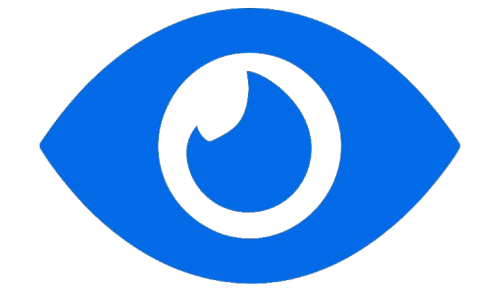
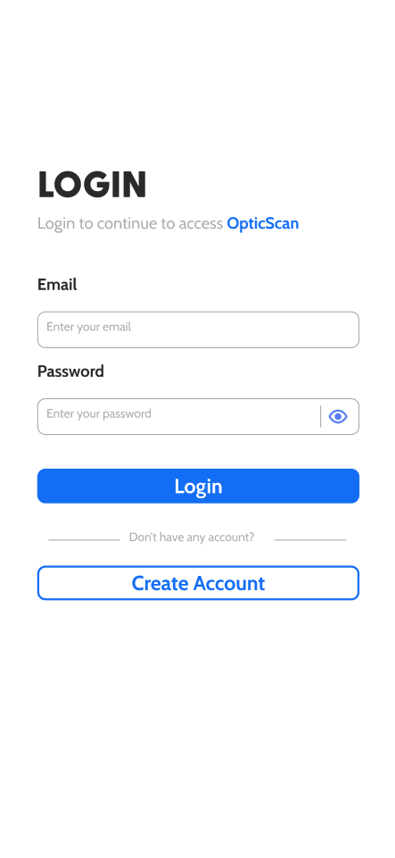
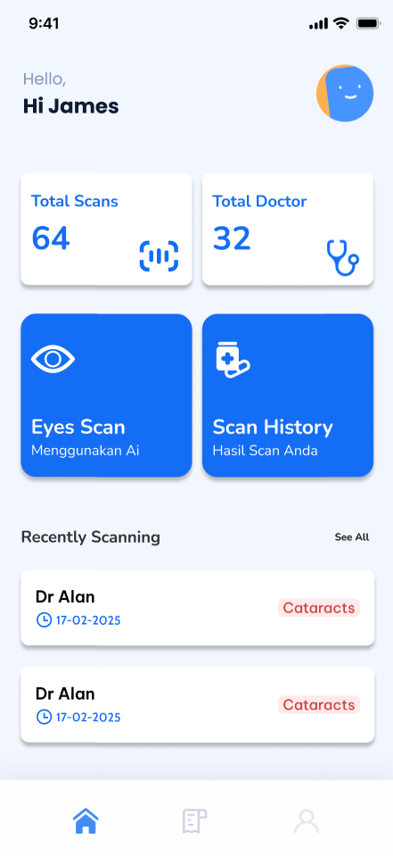
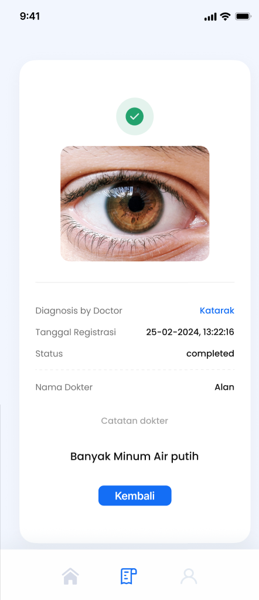
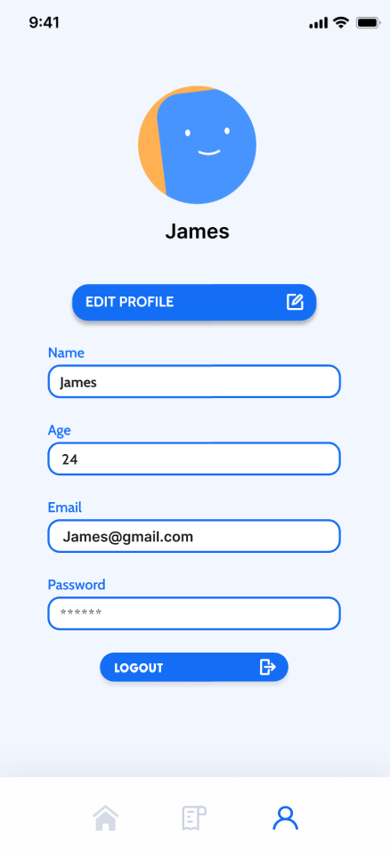

#  OpticScan
 

**OpticScan** is a smart mobile application designed to help diagnose eye diseases using **Artificial Intelligence (AI)** as well as **direct consultation with doctors**. The app aims to make eye care more **accessible, reliable, and efficient** by combining the power of AI with professional medical expertise.  
<div align="center">
  
  
  
  
</div>

---

## ✨ Features  

- 🔍 **AI-Powered Diagnosis** – Upload or capture an image of your eye, and let the AI analyze it to detect possible eye conditions.  
- 👨‍⚕️ **Doctor Consultation** – Get a second opinion from certified doctors to confirm or refine AI results.  
- 📊 **Personal Health Records** – Keep track of your past diagnoses, consultation history, and reports in one secure place.  
- 🔔 **Smart Notifications** – Receive reminders for check-ups, follow-ups, and treatment schedules.  
- 🌐 **Accessible Anytime, Anywhere** – Designed for mobile devices, ensuring you can use OpticScan wherever you are.  

---

## 📥 Download  

You can try the app by downloading the latest APK release here:  

👉 [**Download OpticScan APK**](https://github.com/your-username/optic-scan/releases)  

*(Make sure to allow installation from unknown sources on your device settings.)*  

---

## 🚀 Tech Stack  

- **Frontend**: Flutter (cross-platform mobile development)  
- **Backend**: Java / Firebase integration  
- **Database**: Firebase & MongoDB Atlas  
- **AI Integration**: Machine Learning models for image recognition and diagnosis  
- **Cloud Services**: Scalable infrastructure to support real-time diagnosis and consultations  

---

## 📱 How It Works  

1. **Capture or Upload Image** – Take a picture of your eye or upload an existing one.  
2. **AI Analysis** – The AI model processes the image and provides a preliminary diagnosis.  
3. **Doctor Review** – Connect with doctors through the app for confirmation and further recommendations.  
4. **Track & Manage** – View results, treatment history, and health reports anytime.  

---

## 🛠️ Installation (For Developers)  

```bash
# Clone the repository
git clone https://github.com/your-username/optic-scan.git

# Navigate into the project
cd optic-scan

# Install dependencies
flutter pub get

# Run the app
flutter run
```

---

## 📖 Roadmap  

- [ ] Expand AI model for more eye diseases  
- [ ] Add telemedicine (video consultation with doctors)  
- [ ] Multi-language support  
- [ ] Integration with wearable devices  

---

## 🤝 Contributing  

We welcome contributions from the community!  
Feel free to fork this repo, create a branch, and submit a pull request.  

---

## 📄 License  

This project is licensed under the **MIT License** – see the [LICENSE](LICENSE) file for details.  

---
